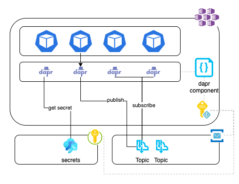
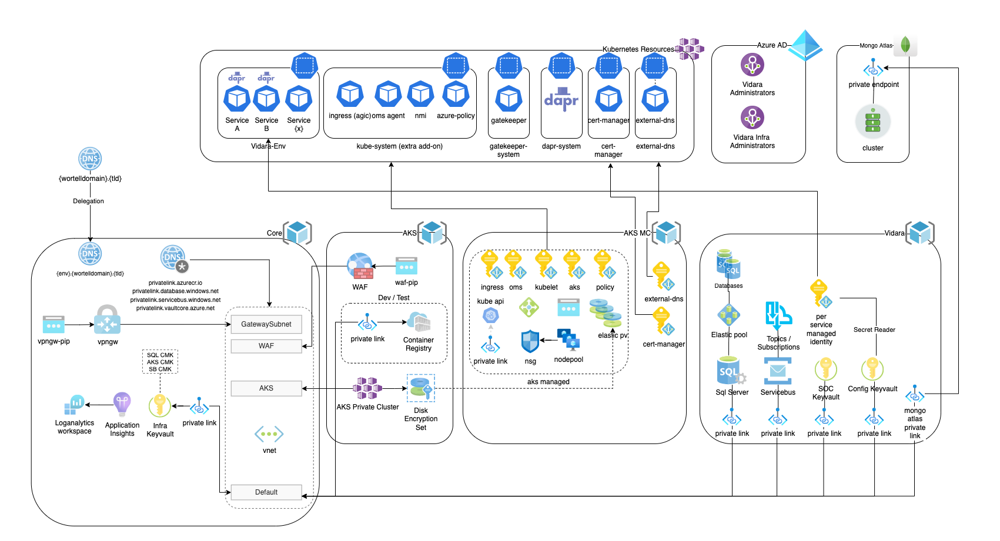

# Challenge

[Wortell](https://www.wortell.nl/en) is the leading Microsoft partner operating its services in the Netherlands, Belgium and Luxembtheirg. Wortell provides a cloud-native [Managed Detect and Response (MDR)](https://www.wortell.nl/en/products/managed-detection-and-response-en) service to secure its clients based on Microsoft Sentinel and Microsoft Defender 365 operating 24/7/365 by a team of dedicated security professionals. 

The service is facilitated by a build for purpose home grown software solution running on dotnet, called **Vidara**, which handles key apsects of connecting multiple customers, executing MDR and SOC processes, response automation, and more. The software solution exists of many microservices, runs on Kubernetes, interacts with cloud restheirces and is continuously expanded.

As the software matures, it becomes exponentially more difficult to simply focus the engineering effort on the business goals as the infrastructure and application architecture evolve into a more and more complex system which is tightly integrated into the software stack. Evolving the software required more and more specialized expertise and time from the developers, impacting the velocity of the business development process.

# Solution

To deal with the ever increasing complexity of the application and infrastructure architecture, they started adopting dapr. Dapr takes on many of the responsibilities of interacting with infrastructure and simplifies inter application processes. As they where already using Kubernetes (Azure Kubernetes Service) and deploy their application with Helm charts, the side car architecture of dapr was an easy fit for us. At first they started utilizing the pub/sub component and over time they gradually started using other components as theyll. Currently they are using pub/sub, secrets, secure service to service communication and are planning on using the state component and policy feature in the near future.

# Impact

By adopting dapr, they were able to remove several software packages and a great deal of code from all of their microservice. Instead they could simply adopt the simple dapr interfaces from their [dotnet sdk](https://docs.dapr.io/developing-applications/sdks/dotnet/) and thereby offload dealing with infrastructure and async inter process communication to the dapr runtime. This greatly reduces the complexity and amount of required infrastructure related code, allowing us to have more focus on the business features.

# Vidara and dapr

Vidara handles multiple customers, MDR / SOC processes, automation, and more. It processes data from customers that subscribed to the service by interacting with their Microsoft Sentinel instances, which are loaded with Wortell developed security detection use cases, and applies automated analysis and triaging to filter out and close the false positives or escalaties to security analysts and facilitate their process (assignment, logging, running automations, etc).

With Vidara, they started using dapr in production with version 0.12 preview 1 on februari 2021 for the first component. Over time, and as dapr ga-ed and they become more familiar with dapr, they started adopting more and more components and features.

## Vidara Application architecture

The first component they adopted was the [pub/sub component](https://docs.dapr.io/developing-applications/building-blocks/pubsub/pubsub-overview/). Doing this enabled us to remove multiple libraries and code paths dealing with Azure Service Bus and RabbitMQ. Next they started using the secrets component. As this component only deals with getting secrets, not setting them, they where able to remove the libraries dealing with Azure KeyVault from all their services besides the one that deals with setting the secrets.

Service to service communication was next. Using [service to service invocation](https://docs.dapr.io/developing-applications/building-blocks/service-invocation/service-invocation-overview/) with dapr results in mTLS based communication with service auto discovery for free.

With newer versions of dapr, [Azure Managed Identities became supported](https://docs.dapr.io/developing-applications/integrations/azure/authenticating-azure/#using-managed-service-identities) to have dapr components interact with Azure components without the need to have configured secrets. they started using AKS Managed Pod Identity together to provide dapr with the required managed identity access and since then, they don't have any secrets in their application configuration / helm chart anymore.

Most recently they adopted the dapr secret store configuration provider. This allows dapr to pre-fetch application specific secrets from any secrets provider (in their case, Azure KeyVault) and inject them into the application configuration for use. Remaining application secrets are now provided at startup removing the need to have any secrets in local application settings or configuration files.

## Vidara Infrastructure

The Vidara infrastructure is running on Azure Kubernetes Service and interfaces with a number of Azure and MongoDb restheirces. Besides application specific needs, there are also restheirces involved with manageability and security requirements. To manage all this, Wortell uses GitHub Workflows together with Pulumi for infrastructure lifecycle management. Managing the environment is strictly following processes where permissions are acquired only when needed and for example, private connectivity is established.

## Local Development made easy

Local development was greatly simplified recently. they switched from running a local Kubernetes cluster to using [project Tye](https://devblogs.microsoft.com/dotnet/introducing-project-tye/) together with dapr. Using Tye, they can easily use dapr component configurations (yaml files) reflecting local target systems without the need to reflect this in code anymore. For example, they used to have code paths that dealt with Azure Service Bus for dtap and RabbitMQ for local development, switching desired targets by supplying application configuration at startup. With dapr, they still target Azure Service Bus for dtap and they switched to redis for local development, the application code hotheyver isn't aware of any of this. Configuration and interfacing with these system is fully external to the application.
