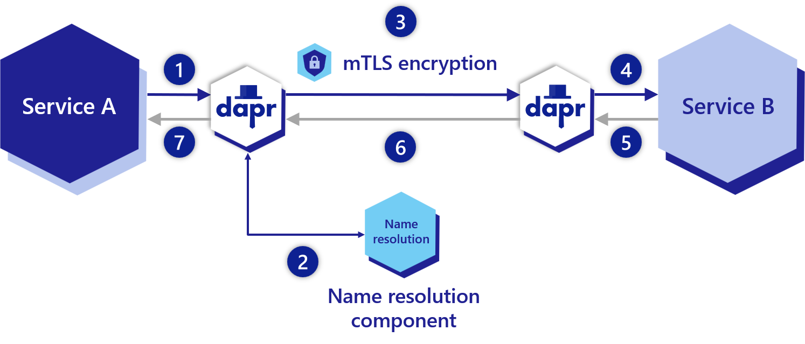

# Challenge

[Wortell](https://www.wortell.nl/en) is a leading Microsoft partner operating its services in the Netherlands, Belgium and Luxembourg. Wortell provides a cloud-native [Managed Detect and Response (MDR)](https://www.wortell.nl/en/products/managed-detection-and-response-en) service to secure its clients based on Microsoft Sentinel and Microsoft Defender 365 operating 24/7/365 by a team of dedicated security professionals.

The service is facilitated by a build for purpose home grown software solution running on .NET, called **Vidara**, which handles key aspects of connecting multiple customers, executing MDR and SOC processes, response automation, and more. The software solution exists of many microservices, runs on Kubernetes, interacts with cloud resources and is continuously expanded.

As the software matures, it becomes exponentially more difficult to simply focus the engineering effort on the business goals as the infrastructure and application architecture transformed into an ever more complex system. Evolving the software required more and more specialized expertise and time from the developers, impacting the overall velocity of the team.

# Solution

To deal with the ever increasing complexity of the application and infrastructure architecture, Wortell started adopting **dapr**. Dapr takes on many of the responsibilities of interacting with infrastructure and simplifies inter application processes. As they where already using Kubernetes (Azure Kubernetes Service) and deploy their application with Helm charts, the side car architecture of dapr was an easy fit for them. At first they started utilizing the pub/sub component and over time they gradually started using other components as well. Currently they are using pub/sub, secrets, secure service to service communication and are planning on using the state component and policy feature in the near future.

# Impact

By adopting dapr, they were able to remove several software packages and a great deal of code from all of their microservices. Instead they where able to adopt the relatively simple dapr interfaces from the [.NET SDK](https://docs.dapr.io/developing-applications/sdks/dotnet/) and thereby offloaded the dealing with infrastructure and async inter process communication to the dapr runtime. This greatly reduced the complexity and amount of required infrastructure related code, allowing them to have more focus on the business features.

# Vidara and dapr

Vidara handles multiple customers, MDR / SOC processes, automation, and more. It processes data from customers that subscribe to the service by interacting with their Microsoft Sentinel instances, which are loaded with Wortell developed security detection use cases, and applies automated analysis and triaging to filter out and close the false positives or escalates to security analysts and facilitate their process (assignment, logging, running automations, etc).

With Vidara, Wortell started using dapr in production with version 0.12 preview 1 on februari 2021 for the first component. Over time, as dapr ga-ed and they become more familiar with dapr, they started adopting more and more dapr components and features.

## Vidara Application architecture

The first component they adopted was the [pub/sub component](https://docs.dapr.io/developing-applications/building-blocks/pubsub/pubsub-overview/). Doing this enabled them to remove multiple libraries and code paths dealing with Azure Service Bus and RabbitMQ. Next they started using the secrets component. As this component only deals with getting secrets, not setting them, they where able to remove the libraries dealing with Azure KeyVault from all their services besides the one that deals with storing the secrets.

Service to service communication was next. Using [service to service invocation](https://docs.dapr.io/developing-applications/building-blocks/service-invocation/service-invocation-overview/) with dapr results in mTLS based communication with service auto discovery for free.

With newer versions of dapr, [Azure Managed Identities became supported](https://docs.dapr.io/developing-applications/integrations/azure/authenticating-azure/#using-managed-service-identities). This allows dapr components to interact with Azure resources without the need to have any configured secrets. Wortell started using AKS Managed Pod Identity to provide dapr with the required managed identity access and since then, all secrets in application configuration / helm chart(s) have been removed.

Most recently they adopted the dapr secret store configuration provider. This allows dapr to pre-fetch application specific secrets from any secrets provider (in their case, Azure KeyVault) and inject them into the application configuration for use. Remaining application secrets are now provided at startup removing the need to have any of these secrets in application settings or configuration files.

## Vidara Infrastructure

The Vidara infrastructure is running on Azure Kubernetes Service and interfaces with a number of Azure and MongoDB resources. Besides application specific needs, there are also resources involved with manageability and security requirements. To manage all this, Wortell uses GitHub Workflows together with Pulumi for infrastructure lifecycle management. Managing the environment is strictly following processes where permissions are acquired only when needed and for example, private connectivity is established.

## Local Development made easy

Local development was greatly simplified for Wortell developers. They switched from running a local Kubernetes cluster to using [project Tye](https://devblogs.microsoft.com/dotnet/introducing-project-tye/) together with dapr. Using Tye, they can easily use dapr component configurations (yaml files) reflecting local target systems without the need to address this in code anymore. For example, they used to have code paths that dealt with Azure Service Bus for dtap and RabbitMQ for local development, switching desired targets by supplying application configuration at startup. With dapr, they still target Azure Service Bus for dtap and they switched to redis for local development, the application code however isn't aware of any of this. Configuration and interfacing with these systems is fully external to the application.

## Business benefits
Using Vidara, built with Microsoft Azure & dapr, as the backend for their security operations, Wortell has a robust and scalable Managed Detection & Response (MDR) platform that together with Microsoft Sentinel and Microsoft Defender 365 can investigate and respond to cyber threats. With this solution, Wortell needs less people on staff, is quick to respond, and has the means to deliver innovative solutions like its HoneyNetwork (tm) for tailored customer threat intelligence.